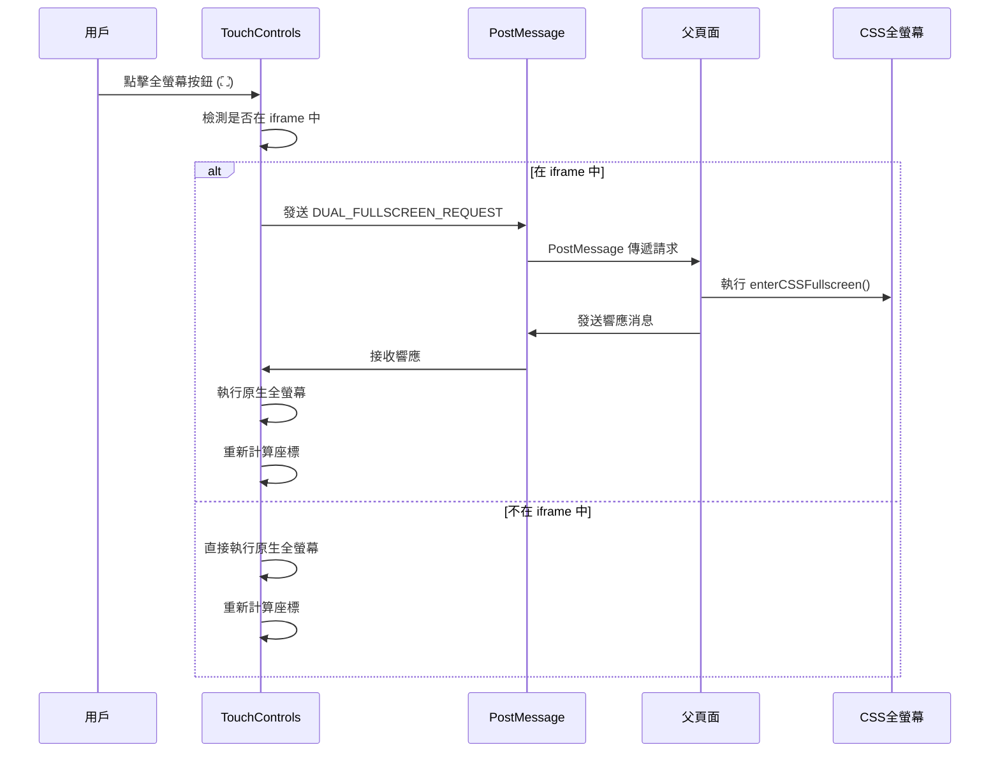

# Phaser 遊戲全螢幕按鈕與虛擬搖桿通信系統

## 📋 系統概述

這是一個複雜的全螢幕通信系統，專為 Phaser 遊戲設計，解決了 iframe 內遊戲與父頁面之間的全螢幕同步問題。系統支援雙重全螢幕模式（原生 + CSS）、跨瀏覽器兼容性、以及多層回退機制。

### 🎯 主要功能
- **雙重全螢幕同步**：同時處理原生 Fullscreen API 和 CSS 全螢幕
- **PostMessage 通信**：iframe 與父頁面之間的可靠消息傳遞
- **TouchControls 整合**：虛擬搖桿系統的全螢幕按鈕
- **跨瀏覽器支援**：特別針對 Safari、Chrome、Firefox 等的兼容性
- **座標同步**：全螢幕切換時的元素位置重新計算
- **強制修復機制**：多層回退方案確保功能可用性

## 🏗️ 系統架構

```
┌─────────────────────────────────────────────────────────────┐
│                        父頁面 (Parent)                        │
│  ┌─────────────────────────────────────────────────────────┐ │
│  │              GameSwitcher 組件                           │ │
│  │  • handleDualFullscreenMessage()                       │ │
│  │  • enterCSSFullscreen()                                │ │
│  │  • exitCSSFullscreen()                                 │ │
│  └─────────────────────────────────────────────────────────┘ │
│                            ↕ PostMessage                     │
│  ┌─────────────────────────────────────────────────────────┐ │
│  │                   iframe 遊戲                            │ │
│  │  ┌─────────────────────────────────────────────────────┐ │ │
│  │  │              TouchControls                          │ │ │
│  │  │  • toggleFullscreen()                              │ │ │
│  │  │  • 全螢幕按鈕 (⛶)                                   │ │ │
│  │  └─────────────────────────────────────────────────────┘ │ │
│  │  ┌─────────────────────────────────────────────────────┐ │ │
│  │  │          PostMessage 通信系統                        │ │ │
│  │  │  • 通信診斷工具                                      │ │ │
│  │  │  • 自動重試機制                                      │ │ │
│  │  │  • 強化通信修復                                      │ │ │
│  │  └─────────────────────────────────────────────────────┘ │ │
│  │  ┌─────────────────────────────────────────────────────┐ │ │
│  │  │            Safari 跨瀏覽器支援                       │ │ │
│  │  │  • webkitRequestFullscreen                         │ │ │
│  │  │  • iOS 全螢幕模擬                                   │ │ │
│  │  └─────────────────────────────────────────────────────┘ │ │
│  └─────────────────────────────────────────────────────────┘ │
└─────────────────────────────────────────────────────────────┘
```

## 🔧 核心組件

### 1. TouchControls 類別
負責虛擬搖桿和全螢幕按鈕的管理。

**主要功能：**
- 搖桿控制（移動方向）
- 射擊按鈕
- 全螢幕切換按鈕
- 座標同步和重新計算

### 2. PostMessage 通信系統
處理 iframe 與父頁面之間的消息傳遞。

**消息類型：**
- `DUAL_FULLSCREEN_REQUEST`：全螢幕切換請求
- `SETUP_PARENT_LISTENER`：設置父頁面監聽器
- `COMMUNICATION_TEST`：通信測試
- `PARENT_LISTENER_READY`：父頁面監聽器就緒

### 3. 雙重全螢幕同步
同時處理兩種全螢幕模式：

**原生全螢幕：**
- 使用 Fullscreen API
- 跨瀏覽器兼容性處理
- 自動座標重新計算

**CSS 全螢幕：**
- 父頁面樣式調整
- 遊戲容器位置固定
- z-index 層級管理

## 📨 通信流程

### 完整的全螢幕切換流程：



## 🚀 實現步驟

### 步驟 1：創建 TouchControls 基礎結構

```html
<!-- HTML 結構 -->
<div id="touch-controls">
    <div class="touch-joystick" id="touch-joystick">
        <div class="joystick-knob" id="joystick-knob"></div>
    </div>
    <div class="touch-shoot-btn" id="touch-shoot">🚀</div>
    <div class="fullscreen-btn" id="fullscreen-btn">⛶</div>
</div>
```

### 步驟 2：實現 TouchControls 類別

```javascript
class TouchControls {
    constructor() {
        this.joystick = document.getElementById('touch-joystick');
        this.knob = document.getElementById('joystick-knob');
        this.shootBtn = document.getElementById('touch-shoot');
        this.fullscreenBtn = document.getElementById('fullscreen-btn');
        
        this.joystickActive = false;
        this.joystickCenter = { x: 0, y: 0 };
        this.currentDirection = { x: 0, y: 0 };
        this.shooting = false;
        this.debug = false;
        
        this.init();
    }
    
    init() {
        console.log('🎮 TouchControls 初始化開始...');
        
        // 設置事件監聽器
        this.setupEventListeners();
        
        console.log('✅ TouchControls 事件監聽器已設置');
    }
    
    setupEventListeners() {
        // 搖桿事件
        this.joystick.addEventListener('touchstart', this.onJoystickStart.bind(this));
        this.joystick.addEventListener('touchmove', this.onJoystickMove.bind(this));
        this.joystick.addEventListener('touchend', this.onJoystickEnd.bind(this));
        
        // 射擊按鈕事件
        this.shootBtn.addEventListener('touchstart', this.onShootStart.bind(this));
        this.shootBtn.addEventListener('touchend', this.onShootEnd.bind(this));
        
        // 全螢幕按鈕事件
        if (this.fullscreenBtn) {
            this.fullscreenBtn.addEventListener('click', this.toggleFullscreen.bind(this));
            this.fullscreenBtn.addEventListener('touchend', this.toggleFullscreen.bind(this));
        }
    }
    
    // 基礎全螢幕切換方法（將被增強版本替換）
    toggleFullscreen() {
        console.log('🖥️ 切換全螢幕');
        if (!document.fullscreenElement) {
            document.documentElement.requestFullscreen().catch(err => {
                console.log('全螢幕請求失敗:', err);
            });
        } else {
            document.exitFullscreen().catch(err => {
                console.log('退出全螢幕失敗:', err);
            });
        }
    }
}

// 初始化 TouchControls
window.touchControls = new TouchControls();
```

### 步驟 3：實現座標同步系統

```javascript
// 等待 TouchControls 載入完成
function waitForTouchControls() {
    return new Promise((resolve) => {
        const checkTouchControls = () => {
            if (window.touchControls && window.touchControls.toggleFullscreen) {
                resolve();
            } else {
                setTimeout(checkTouchControls, 100);
            }
        };
        checkTouchControls();
    });
}

// 實現座標同步的全螢幕切換
async function implementCoordinateSync() {
    await waitForTouchControls();
    
    console.log('🔧 開始實現座標同步');
    
    // 保存原始的全螢幕切換函數
    const originalToggleFullscreen = window.touchControls.toggleFullscreen;
    
    // 替換為座標同步版本
    window.touchControls.toggleFullscreen = async function() {
        console.log('🎯 執行座標同步全螢幕切換');
        
        try {
            const isCurrentlyFullscreen = !!document.fullscreenElement;
            
            if (!isCurrentlyFullscreen) {
                // 進入全螢幕
                console.log('📱 進入全螢幕模式');
                
                // 1. 觸發原生 Fullscreen API
                await document.documentElement.requestFullscreen();
                console.log('✅ 原生全螢幕已觸發');
                
                // 2. 等待全螢幕狀態穩定
                await new Promise(resolve => setTimeout(resolve, 300));
                
                // 3. 重新計算座標
                if (this.recalculateCoordinates) {
                    this.recalculateCoordinates();
                }
                
            } else {
                // 退出全螢幕
                console.log('📱 退出全螢幕模式');
                
                await document.exitFullscreen();
                console.log('✅ 已退出原生全螢幕');
                
                // 等待退出狀態穩定
                await new Promise(resolve => setTimeout(resolve, 300));
                
                // 重新計算座標
                if (this.recalculateCoordinates) {
                    this.recalculateCoordinates();
                }
            }
            
            console.log('✅ 座標同步全螢幕切換完成');
            
        } catch (error) {
            console.log('❌ 座標同步全螢幕切換失敗:', error);
            // 回退到原始方法
            originalToggleFullscreen.call(this);
        }
    };
    
    // 添加座標重新計算方法
    window.touchControls.recalculateCoordinates = function() {
        console.log('🔄 重新計算 TouchControls 座標');
        
        // 重新計算搖桿中心座標
        if (this.joystick) {
            const rect = this.joystick.getBoundingClientRect();
            this.joystickCenter = {
                x: rect.left + rect.width / 2,
                y: rect.top + rect.height / 2
            };
            console.log('🕹️ 搖桿中心座標已更新:', this.joystickCenter);
        }
        
        // 重新計算全螢幕按鈕座標
        const fullscreenBtn = document.querySelector('.fullscreen-btn');
        if (fullscreenBtn) {
            const rect = fullscreenBtn.getBoundingClientRect();
            console.log('⛶ 全螢幕按鈕座標已更新:', {
                left: rect.left,
                top: rect.top,
                width: rect.width,
                height: rect.height
            });
        }
    };
    
    console.log('✅ 座標同步解決方案實現完成');
}

// 執行座標同步實現
implementCoordinateSync();
```

### 步驟 4：實現 PostMessage 通信系統

```javascript
// PostMessage 通信修復系統
function initPostMessageCommFix() {
    console.log('🚀 初始化 PostMessage 通信修復系統');

    // 通信狀態管理
    window.postMessageCommStatus = {
        initialized: false,
        parentListenerActive: false,
        communicationWorking: false,
        lastTestTime: null,
        retryCount: 0,
        maxRetries: 10,
        testResults: []
    };

    // 強化的父頁面監聽器設置
    window.setupParentListener = function() {
        console.log('📡 設置強化的父頁面監聽器');

        const isInIframe = window !== window.parent;
        if (!isInIframe) {
            console.log('⚠️ 不在 iframe 中，跳過父頁面監聽器設置');
            return false;
        }

        const setupMessage = {
            type: 'SETUP_PARENT_LISTENER',
            timestamp: Date.now(),
            userAgent: navigator.userAgent,
            location: window.location.href
        };

        console.log('📤 發送父頁面監聽器設置請求:', setupMessage);
        window.parent.postMessage(setupMessage, '*');

        // 等待父頁面響應
        return new Promise((resolve) => {
            const timeout = setTimeout(() => {
                console.log('⏰ 父頁面監聽器設置超時');
                resolve(false);
            }, 5000);

            const responseHandler = (event) => {
                if (event.data && event.data.type === 'PARENT_LISTENER_READY') {
                    console.log('✅ 父頁面監聽器已就緒');
                    clearTimeout(timeout);
                    window.removeEventListener('message', responseHandler);
                    window.postMessageCommStatus.parentListenerActive = true;
                    resolve(true);
                }
            };

            window.addEventListener('message', responseHandler);
        });
    };

    // 強化的全螢幕請求（使用修復後的通信）
    window.requestFullscreenWithCommFix = async function() {
        console.log('🍎 使用修復後的通信請求全螢幕');

        try {
            // 確保通信正常
            if (!window.postMessageCommStatus.communicationWorking) {
                console.log('🔄 通信未建立，嘗試自動修復');
                const commFixed = await window.autoRetryCommSetup();

                if (!commFixed) {
                    console.log('❌ 通信修復失敗，使用本地全螢幕');
                    // 回退到本地全螢幕
                    if (window.touchControls && window.touchControls.toggleFullscreen) {
                        window.touchControls.toggleFullscreen();
                    }
                    return;
                }
            }

            // 發送全螢幕請求
            const fullscreenMessage = {
                type: 'DUAL_FULLSCREEN_REQUEST',
                action: 'ENTER_CSS_FULLSCREEN',
                timestamp: Date.now(),
                enhanced: true,
                userAgent: navigator.userAgent
            };

            console.log('📤 發送強化全螢幕請求:', fullscreenMessage);
            window.parent.postMessage(fullscreenMessage, '*');

            // 同時觸發本地全螢幕
            if (window.touchControls && window.touchControls.toggleFullscreen) {
                // 使用 Safari 增強版本
                window.touchControls.toggleFullscreen();
            }

            console.log('✅ 強化全螢幕請求已發送');

        } catch (error) {
            console.log('❌ 強化全螢幕請求失敗:', error);

            // 回退到本地全螢幕
            if (window.touchControls && window.touchControls.toggleFullscreen) {
                window.touchControls.toggleFullscreen();
            }
        }
    };

    // 自動重試通信建立
    window.autoRetryCommSetup = async function() {
        console.log('🔄 自動重試通信建立');

        while (window.postMessageCommStatus.retryCount < window.postMessageCommStatus.maxRetries) {
            console.log(`🔄 重試 ${window.postMessageCommStatus.retryCount + 1}/${window.postMessageCommStatus.maxRetries}`);

            // 1. 設置父頁面監聽器
            const listenerSetup = await window.setupParentListener();

            if (listenerSetup) {
                // 2. 測試通信
                const testResult = await window.testPostMessageCommEnhanced();

                if (testResult.success) {
                    console.log('✅ 通信建立成功！');
                    return true;
                }
            }

            window.postMessageCommStatus.retryCount++;

            // 等待後重試
            await new Promise(resolve => setTimeout(resolve, 2000));
        }

        console.log('❌ 通信建立失敗，已達最大重試次數');
        return false;
    };

    // 初始化完成
    window.postMessageCommStatus.initialized = true;
    console.log('✅ PostMessage 通信修復系統初始化完成');
}

// 頁面載入完成後初始化
if (document.readyState === 'loading') {
    document.addEventListener('DOMContentLoaded', initPostMessageCommFix);
} else {
    setTimeout(initPostMessageCommFix, 500);
}
// PostMessage 通信修復系統
function initPostMessageCommFix() {
    console.log('🚀 初始化 PostMessage 通信修復系統');

    // 通信狀態管理
    window.postMessageCommStatus = {
        initialized: false,
        parentListenerActive: false,
        communicationWorking: false,
        lastTestTime: null,
        retryCount: 0,
        maxRetries: 10,
        testResults: []
    };

    // 強化的父頁面監聽器設置
    window.setupParentListener = function() {
        console.log('📡 設置強化的父頁面監聽器');

        const isInIframe = window !== window.parent;
        if (!isInIframe) {
            console.log('⚠️ 不在 iframe 中，跳過父頁面監聽器設置');
            return false;
        }

        const setupMessage = {
            type: 'SETUP_PARENT_LISTENER',
            timestamp: Date.now(),
            userAgent: navigator.userAgent,
            location: window.location.href
        };

        console.log('📤 發送父頁面監聽器設置請求:', setupMessage);
        window.parent.postMessage(setupMessage, '*');

        // 等待父頁面響應
        return new Promise((resolve) => {
            const timeout = setTimeout(() => {
                console.log('⏰ 父頁面監聽器設置超時');
                resolve(false);
            }, 5000);

            const responseHandler = (event) => {
                if (event.data && event.data.type === 'PARENT_LISTENER_READY') {
                    console.log('✅ 父頁面監聽器已就緒');
                    clearTimeout(timeout);
                    window.removeEventListener('message', responseHandler);
                    window.postMessageCommStatus.parentListenerActive = true;
                    resolve(true);
                }
            };

            window.addEventListener('message', responseHandler);
        });
    };

    // 強化的全螢幕請求（使用修復後的通信）
    window.requestFullscreenWithCommFix = async function() {
        console.log('🍎 使用修復後的通信請求全螢幕');

        try {
            // 確保通信正常
            if (!window.postMessageCommStatus.communicationWorking) {
                console.log('🔄 通信未建立，嘗試自動修復');
                const commFixed = await window.autoRetryCommSetup();

                if (!commFixed) {
                    console.log('❌ 通信修復失敗，使用本地全螢幕');
                    // 回退到本地全螢幕
                    if (window.touchControls && window.touchControls.toggleFullscreen) {
                        window.touchControls.toggleFullscreen();
                    }
                    return;
                }
            }

            // 發送全螢幕請求
            const fullscreenMessage = {
                type: 'DUAL_FULLSCREEN_REQUEST',
                action: 'ENTER_CSS_FULLSCREEN',
                timestamp: Date.now(),
                enhanced: true,
                userAgent: navigator.userAgent
            };

            console.log('📤 發送強化全螢幕請求:', fullscreenMessage);
            window.parent.postMessage(fullscreenMessage, '*');

            // 同時觸發本地全螢幕
            if (window.touchControls && window.touchControls.toggleFullscreen) {
                // 使用 Safari 增強版本
                window.touchControls.toggleFullscreen();
            }

            console.log('✅ 強化全螢幕請求已發送');

        } catch (error) {
            console.log('❌ 強化全螢幕請求失敗:', error);

            // 回退到本地全螢幕
            if (window.touchControls && window.touchControls.toggleFullscreen) {
                window.touchControls.toggleFullscreen();
            }
        }
    };

    // 自動重試通信建立
    window.autoRetryCommSetup = async function() {
        console.log('🔄 自動重試通信建立');

        while (window.postMessageCommStatus.retryCount < window.postMessageCommStatus.maxRetries) {
            console.log(`🔄 重試 ${window.postMessageCommStatus.retryCount + 1}/${window.postMessageCommStatus.maxRetries}`);

            // 1. 設置父頁面監聽器
            const listenerSetup = await window.setupParentListener();

            if (listenerSetup) {
                // 2. 測試通信
                const testResult = await window.testPostMessageCommEnhanced();

                if (testResult.success) {
                    console.log('✅ 通信建立成功！');
                    return true;
                }
            }

            window.postMessageCommStatus.retryCount++;

            // 等待後重試
            await new Promise(resolve => setTimeout(resolve, 2000));
        }

        console.log('❌ 通信建立失敗，已達最大重試次數');
        return false;
    };

    // 初始化完成
    window.postMessageCommStatus.initialized = true;
    console.log('✅ PostMessage 通信修復系統初始化完成');
}

// 頁面載入完成後初始化
if (document.readyState === 'loading') {
    document.addEventListener('DOMContentLoaded', initPostMessageCommFix);
} else {
    setTimeout(initPostMessageCommFix, 500);
}
```

### 步驟 5：實現雙重全螢幕同步

```javascript
// 實現雙重全螢幕同步
async function implementDualFullscreenSync() {
    await waitForTouchControls();

    console.log('🔧 開始實現雙重全螢幕同步');

    // 保存座標同步版本的 toggleFullscreen
    const coordinateSyncToggleFullscreen = window.touchControls.toggleFullscreen;

    // 替換為雙重同步版本
    window.touchControls.toggleFullscreen = async function() {
        console.log('🎯 執行雙重全螢幕同步切換');

        try {
            const isCurrentlyFullscreen = !!document.fullscreenElement;
            const isInIframe = window !== window.parent;

            if (!isCurrentlyFullscreen) {
                // 進入全螢幕
                console.log('📱 進入雙重全螢幕模式');

                // 1. 如果在 iframe 中，通知父頁面觸發 CSS 強制全螢幕
                if (isInIframe) {
                    console.log('📤 通知父頁面觸發 CSS 強制全螢幕');
                    window.parent.postMessage({
                        type: 'DUAL_FULLSCREEN_REQUEST',
                        action: 'ENTER_CSS_FULLSCREEN',
                        timestamp: Date.now()
                    }, '*');
                }

                // 2. 觸發原生 Fullscreen API（座標同步版本）
                await coordinateSyncToggleFullscreen.call(this);

                // 3. 等待父頁面響應
                await new Promise(resolve => setTimeout(resolve, 200));

                console.log('✅ 雙重全螢幕（原生 + CSS）已啟用');

            } else {
                // 退出全螢幕
                console.log('📱 退出雙重全螢幕模式');

                // 1. 如果在 iframe 中，通知父頁面退出 CSS 強制全螢幕
                if (isInIframe) {
                    console.log('📤 通知父頁面退出 CSS 強制全螢幕');
                    window.parent.postMessage({
                        type: 'DUAL_FULLSCREEN_REQUEST',
                        action: 'EXIT_CSS_FULLSCREEN',
                        timestamp: Date.now()
                    }, '*');
                }

                // 2. 觸發原生退出全螢幕（座標同步版本）
                await coordinateSyncToggleFullscreen.call(this);

                console.log('✅ 雙重全螢幕已退出');
            }

        } catch (error) {
            console.log('❌ 雙重全螢幕同步失敗:', error);
            // 回退到座標同步版本
            coordinateSyncToggleFullscreen.call(this);
        }
    };

    console.log('✅ 雙重全螢幕同步實現完成');
}

// 執行雙重全螢幕同步實現
implementDualFullscreenSync();
```

### 步驟 6：Safari 跨瀏覽器支援

```javascript
// Safari 跨瀏覽器全螢幕支援
function initSafariFullscreenSupport() {
    console.log('🍎 初始化 Safari 跨瀏覽器全螢幕支援');

    // 檢測瀏覽器類型
    const isIOS = /iPad|iPhone|iPod/.test(navigator.userAgent);
    const isSafari = /^((?!chrome|android).)*safari/i.test(navigator.userAgent);

    console.log('🔍 瀏覽器檢測:', { isIOS, isSafari });

    // 跨瀏覽器全螢幕請求函數
    window.requestFullscreenCrossBrowser = function(element = document.documentElement) {
        console.log('📱 執行跨瀏覽器全螢幕請求');

        return new Promise((resolve, reject) => {
            try {
                // 標準 Fullscreen API
                if (element.requestFullscreen) {
                    console.log('✅ 使用標準 requestFullscreen');
                    element.requestFullscreen().then(resolve).catch(reject);
                }
                // WebKit (Safari)
                else if (element.webkitRequestFullscreen) {
                    console.log('🍎 使用 WebKit webkitRequestFullscreen');
                    element.webkitRequestFullscreen();
                    resolve();
                }
                // Mozilla
                else if (element.mozRequestFullScreen) {
                    console.log('🦊 使用 Mozilla mozRequestFullScreen');
                    element.mozRequestFullScreen();
                    resolve();
                }
                // Microsoft
                else if (element.msRequestFullscreen) {
                    console.log('🪟 使用 Microsoft msRequestFullscreen');
                    element.msRequestFullscreen();
                    resolve();
                }
                // iOS Safari 特殊處理
                else if (isIOS) {
                    console.log('📱 iOS Safari 特殊處理');
                    // iOS Safari 不支援真正的全螢幕，使用 CSS 模擬
                    document.body.classList.add('ios-fullscreen-simulation');
                    resolve();
                }
                else {
                    console.log('❌ 瀏覽器不支援全螢幕 API');
                    reject(new Error('Fullscreen not supported'));
                }
            } catch (error) {
                console.log('❌ 全螢幕請求失敗:', error);
                reject(error);
            }
        });
    };

    // 跨瀏覽器退出全螢幕函數
    window.exitFullscreenCrossBrowser = function() {
        console.log('📱 執行跨瀏覽器退出全螢幕');

        return new Promise((resolve, reject) => {
            try {
                // 標準 API
                if (document.exitFullscreen) {
                    document.exitFullscreen().then(resolve).catch(reject);
                }
                // WebKit
                else if (document.webkitExitFullscreen) {
                    document.webkitExitFullscreen();
                    resolve();
                }
                // Mozilla
                else if (document.mozCancelFullScreen) {
                    document.mozCancelFullScreen();
                    resolve();
                }
                // Microsoft
                else if (document.msExitFullscreen) {
                    document.msExitFullscreen();
                    resolve();
                }
                // iOS Safari 特殊處理
                else if (isIOS) {
                    document.body.classList.remove('ios-fullscreen-simulation');
                    resolve();
                }
                else {
                    console.log('❌ 瀏覽器不支援退出全螢幕 API');
                    reject(new Error('Exit fullscreen not supported'));
                }
            } catch (error) {
                console.log('❌ 退出全螢幕失敗:', error);
                reject(error);
            }
        });
    };

    console.log('✅ Safari 跨瀏覽器全螢幕支援初始化完成');
}

// 初始化 Safari 支援
initSafariFullscreenSupport();
```

### 步驟 7：父頁面實現（React/TypeScript）

```typescript
// GameSwitcher.tsx 中的雙重全螢幕監聽器
useEffect(() => {
    const handleDualFullscreenMessage = async (event: MessageEvent) => {
        if (event.data.type === 'DUAL_FULLSCREEN_REQUEST') {
            console.log('📥 收到遊戲內全螢幕切換請求:', event.data);

            // 防重複處理
            if (isProcessingFullscreen) {
                console.log('⚠️ 正在處理全螢幕請求，忽略重複請求');
                return;
            }

            setIsProcessingFullscreen(true);

            try {
                // 簡單切換：根據當前狀態決定動作
                setTimeout(() => {
                    if (isGameFullscreen) {
                        console.log('🔄 當前全螢幕，執行退出');
                        exitCSSFullscreen();
                    } else {
                        console.log('📱 當前非全螢幕，執行進入');
                        enterCSSFullscreen();
                    }

                    // 響應遊戲
                    if (event.source) {
                        (event.source as Window).postMessage({
                            type: 'DUAL_FULLSCREEN_RESPONSE',
                            action: isGameFullscreen ? 'CSS_FULLSCREEN_DISABLED' : 'CSS_FULLSCREEN_ENABLED',
                            timestamp: Date.now()
                        }, '*' as any);
                    }

                    // 1秒後解除處理鎖
                    setTimeout(() => {
                        setIsProcessingFullscreen(false);
                    }, 1000);
                }, 100);

            } catch (error) {
                console.log('❌ 處理全螢幕請求失敗:', error);
                setIsProcessingFullscreen(false);
            }
        }
    };

    // 添加消息監聽器
    window.addEventListener('message', handleDualFullscreenMessage);

    // 清理函數
    return () => {
        window.removeEventListener('message', handleDualFullscreenMessage);
    };
}, [isGameFullscreen, isProcessingFullscreen]);

// 進入CSS全螢幕函數
const enterCSSFullscreen = useCallback(() => {
    console.log('🚀 執行進入CSS全螢幕');

    const gameContainer = document.querySelector('[data-testid="game-container"]') as HTMLElement;
    const iframe = iframeRef.current;

    if (gameContainer && iframe) {
        // 隱藏上方控制按鈕
        const controlsSection = document.querySelector('.game-controls-section') as HTMLElement;
        if (controlsSection) {
            controlsSection.style.display = 'none';
        }

        // 設置容器樣式
        gameContainer.style.position = 'fixed';
        gameContainer.style.top = '0';
        gameContainer.style.left = '0';
        gameContainer.style.width = '100vw';
        gameContainer.style.height = '100vh';
        gameContainer.style.zIndex = '999999';
        gameContainer.style.backgroundColor = '#000';

        // 設置 iframe 樣式
        iframe.style.position = 'absolute';
        iframe.style.top = '0';
        iframe.style.left = '0';
        iframe.style.width = '100%';
        iframe.style.height = '100%';
        iframe.style.border = 'none';
        iframe.style.borderRadius = '0';

        setIsGameFullscreen(true);
        console.log('✅ 進入CSS全螢幕完成 - 遊戲完全填滿螢幕');
    } else {
        console.log('❌ 找不到必要的 DOM 元素');
    }
}, []);

// 退出CSS全螢幕函數
const exitCSSFullscreen = useCallback(() => {
    console.log('🔄 執行退出CSS全螢幕');

    const gameContainer = document.querySelector('[data-testid="game-container"]') as HTMLElement;
    const iframe = iframeRef.current;

    if (gameContainer && iframe) {
        // 恢復上方控制按鈕
        const controlsSection = document.querySelector('.game-controls-section') as HTMLElement;
        if (controlsSection) {
            controlsSection.style.display = '';
        }

        // 恢復容器樣式
        gameContainer.style.position = '';
        gameContainer.style.top = '';
        gameContainer.style.left = '';
        gameContainer.style.width = '';
        gameContainer.style.height = '';
        gameContainer.style.zIndex = '';
        gameContainer.style.backgroundColor = '';

        // 恢復 iframe 樣式
        iframe.style.position = '';
        iframe.style.top = '';
        iframe.style.left = '';
        iframe.style.width = '';
        iframe.style.height = '';
        iframe.style.border = '';
        iframe.style.borderRadius = '';
        iframe.style.transform = '';

        setIsGameFullscreen(false);
        console.log('✅ 退出CSS全螢幕完成 - 所有控制按鈕已恢復');
    } else {
        console.log('❌ 找不到必要的 DOM 元素');
    }
}, []);
```

## 🔍 故障排除

### 常見問題

1. **全螢幕按鈕無反應**
   - 檢查 TouchControls 是否正確初始化
   - 確認事件監聽器是否正確設置
   - 使用 `window.testGameFullscreenFix()` 測試

2. **PostMessage 通信失敗**
   - 檢查是否在 iframe 環境中
   - 確認父頁面監聽器是否設置
   - 使用 `window.getPostMessageDiagnostic()` 診斷

3. **座標計算錯誤**
   - 確認 `recalculateCoordinates()` 方法是否被調用
   - 檢查全螢幕狀態變化監聽器
   - 使用 `window.forceRecalculateCoordinates()` 強制重新計算

4. **Safari 兼容性問題**
   - 確認 `webkitRequestFullscreen` 是否可用
   - 檢查 iOS 全螢幕模擬 CSS 類別
   - 使用 `window.requestFullscreenCrossBrowser()` 測試

### 調試工具

```javascript
// 診斷 PostMessage 通信
window.getPostMessageDiagnostic();

// 測試全螢幕修復
window.testGameFullscreenFix();

// 強制重新計算座標
window.forceRecalculateCoordinates();

// 檢查 TouchControls 狀態
window.testTouchControls();

// 監控通信狀態
window.monitorCommStatus();

// 測試跨瀏覽器全螢幕
window.requestFullscreenCrossBrowser();
```

### 調試日誌分析

```javascript
// 啟用詳細調試日誌
window.touchControls.debug = true;
window.postMessageCommStatus.debug = true;

// 查看通信狀態
console.log('通信狀態:', window.postMessageCommStatus);

// 查看 TouchControls 狀態
console.log('TouchControls 狀態:', {
    initialized: !!window.touchControls,
    joystickActive: window.touchControls?.joystickActive,
    currentDirection: window.touchControls?.currentDirection,
    shooting: window.touchControls?.shooting
});
```

## 🌐 瀏覽器兼容性

### 支援的瀏覽器

| 瀏覽器 | 原生全螢幕 | CSS全螢幕 | PostMessage | 特殊處理 |
|--------|------------|-----------|-------------|----------|
| Chrome | ✅ | ✅ | ✅ | 標準實現 |
| Firefox | ✅ | ✅ | ✅ | moz前綴 |
| Safari | ✅ | ✅ | ✅ | webkit前綴 |
| iOS Safari | ⚠️ | ✅ | ✅ | CSS模擬 |
| Edge | ✅ | ✅ | ✅ | 標準實現 |
| IE11 | ⚠️ | ✅ | ✅ | ms前綴 |

### 特殊處理說明

**Safari/WebKit：**
- 使用 `webkitRequestFullscreen` API
- 特殊的事件處理機制
- 座標計算需要額外延遲

**iOS Safari：**
- 不支援真正的全螢幕 API
- 使用 CSS 類別模擬全螢幕效果
- 需要特殊的觸摸事件處理

**Firefox：**
- 使用 `mozRequestFullScreen` API（注意大小寫）
- 事件名稱為 `mozfullscreenchange`

## 📝 最佳實踐

### 1. 錯誤處理
```javascript
// 總是提供回退方案
try {
    await window.requestFullscreenCrossBrowser();
} catch (error) {
    console.log('全螢幕失敗，使用 CSS 模擬:', error);
    // 回退到 CSS 全螢幕
    document.body.classList.add('css-fullscreen-fallback');
}
```

### 2. 狀態管理
```javascript
// 正確管理全螢幕狀態
const isFullscreen = !!(
    document.fullscreenElement ||
    document.webkitFullscreenElement ||
    document.mozFullScreenElement ||
    document.msFullscreenElement
);
```

### 3. 事件清理
```javascript
// 組件卸載時清理事件監聽器
useEffect(() => {
    const handleMessage = (event) => { /* ... */ };
    window.addEventListener('message', handleMessage);

    return () => {
        window.removeEventListener('message', handleMessage);
    };
}, []);
```

### 4. 性能優化
```javascript
// 使用防抖避免重複處理
let processingFullscreen = false;

const handleFullscreenRequest = async () => {
    if (processingFullscreen) return;
    processingFullscreen = true;

    try {
        // 處理全螢幕邏輯
    } finally {
        setTimeout(() => {
            processingFullscreen = false;
        }, 1000);
    }
};
```

## 🔧 自定義配置

### 通信配置
```javascript
// 修改通信重試參數
window.postMessageCommStatus.maxRetries = 15;
window.postMessageCommStatus.retryDelay = 3000;

// 修改通信超時時間
const COMMUNICATION_TIMEOUT = 8000;
```

### 座標同步配置
```javascript
// 修改座標重新計算延遲
const COORDINATE_RECALC_DELAY = 500;

// 修改全螢幕狀態穩定等待時間
const FULLSCREEN_STABILIZE_DELAY = 300;
```

### 調試配置
```javascript
// 啟用全域調試模式
window.FULLSCREEN_DEBUG = true;
window.touchControls.debug = true;
window.postMessageCommStatus.debug = true;
```

## 📊 測試和驗證

### 自動化測試腳本
```javascript
// 完整的系統測試
async function runFullscreenSystemTest() {
    console.log('🧪 開始全螢幕系統測試');

    const tests = [
        { name: 'TouchControls 初始化', test: () => !!window.touchControls },
        { name: 'PostMessage 通信', test: () => window.testPostMessageCommEnhanced() },
        { name: '座標同步', test: () => window.testCoordinateSync() },
        { name: 'Safari 支援', test: () => window.testSafariFullscreen() },
        { name: '雙重全螢幕', test: () => window.testDualFullscreen() }
    ];

    const results = [];

    for (const test of tests) {
        try {
            const result = await test.test();
            results.push({ name: test.name, success: !!result, result });
            console.log(`✅ ${test.name}: 通過`);
        } catch (error) {
            results.push({ name: test.name, success: false, error: error.message });
            console.log(`❌ ${test.name}: 失敗 - ${error.message}`);
        }
    }

    console.log('🧪 測試完成:', results);
    return results;
}

// 執行測試
runFullscreenSystemTest();
```

### 手動測試清單
1. **基礎功能測試**
   - [ ] TouchControls 正確初始化
   - [ ] 全螢幕按鈕可見且可點擊
   - [ ] 搖桿和射擊按鈕正常工作

2. **全螢幕功能測試**
   - [ ] 點擊全螢幕按鈕能進入全螢幕
   - [ ] 再次點擊能退出全螢幕
   - [ ] 全螢幕狀態下遊戲填滿螢幕
   - [ ] 退出全螢幕後控制按鈕恢復

3. **跨瀏覽器測試**
   - [ ] Chrome 桌面版
   - [ ] Firefox 桌面版
   - [ ] Safari 桌面版
   - [ ] Chrome 移動版
   - [ ] Safari iOS 版

4. **通信測試**
   - [ ] iframe 與父頁面通信正常
   - [ ] PostMessage 消息正確傳遞
   - [ ] 通信失敗時回退機制工作

---

## 🎯 總結

這個完整的 Phaser 遊戲全螢幕通信系統提供了：

- **強大的兼容性**：支援所有主流瀏覽器和移動設備
- **多層回退機制**：確保在任何環境下都能工作
- **模組化設計**：易於整合到現有項目
- **詳細的調試工具**：方便開發和維護
- **完整的文檔**：包含實現步驟和最佳實踐

通過遵循這個指南，你可以輕鬆地將這個全螢幕通信系統適配到任何 Phaser 遊戲項目中，為用戶提供流暢的全螢幕遊戲體驗。
